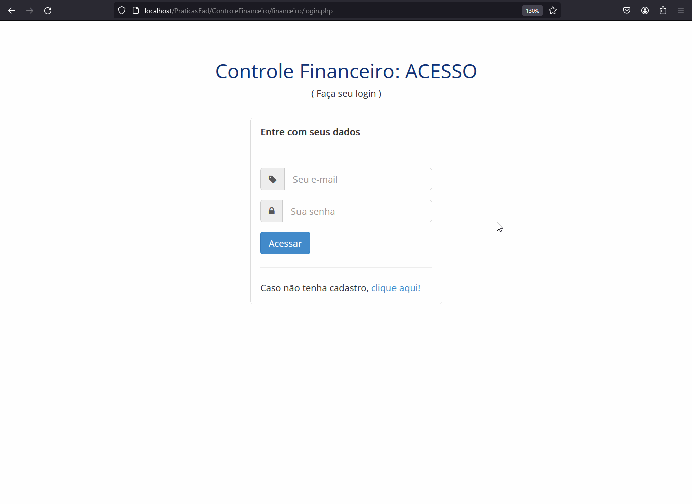

<h1 align="center">
  💵 Controle Financeiro
</h1>

## :rocket: Sobre o projeto

Este é um projeto de estudo desenvolvido com muito carinho durante a realização do curso de Desenvolvimento WEB da escola WMBarros.

O site cotém 3 telas principais sendo tela de login, cadastro e a do sistema em si.
O sistema permite fazer lançamentos de entrada e saída, sendo estes com data, tipo, categoria, empresa, conta, valor e observação, todos alteráveis. 
É possível também vizualizar dados de usuário e alterá-los.

Durante o curso pude desenvolver habilidades como

- Montar Layouts HTML com templates bootstrap;
- Validar campos utilizando JQuery, aumentando a performance do site; 
- Lógica de programação estruturada e orientada a objetos utilizando PHP;
- Bibliotecas, Session e segurança da informação;
- Modelagem do Banco de Dados (MySql) + SQL

## :computer: Tecnologias usadas:

- `PHP`
- `MySQL`
- `Javascript`
- `HTML`
- `CSS`

## :bulb: Telas

